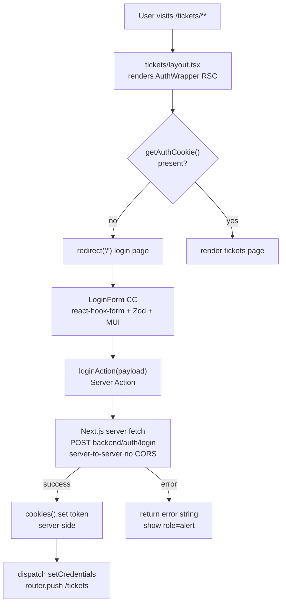

# Login Page + Route Guard Plan

## Clarification

- **Who uses it:** All users — they land on `/` (homepage = login), submit email + password, get a JWT, then land on `/tickets`.
- **Auth required on login page:** No. Auth required on all `/tickets/**` routes: Yes.
- **Data:** Login is a mutation (Client Component + RTK Query). No server-side data fetch on the login page.
- **Interactivity:** Form with validation, loading state, error feedback → Client Component.

## Rendering Strategy

**Login page:** Static RSC shell (`src/app/page.tsx` — root homepage) + Client Component leaf (`LoginForm`). No `fetch()` needed — just the form.

**Route protection:** `AuthWrapper` — an `async` Server Component that reads the `token` cookie via `getAuthCookie()`. If absent it calls `redirect('/')`. Applied **individually per feature layout** — `src/app/tickets/layout.tsx` wraps all ticket routes. `src/app/layout.tsx` (root) is never wrapped; it remains public by default. Each future protected feature area (e.g. `profile/`, `admin/`) adds its own `layout.tsx` with `<AuthWrapper>` independently.

## Data Flow



## API Strategy — Server Actions as Proxy Layer

All backend API calls are made **server-side** through Server Actions. The browser never calls the backend directly, eliminating CORS entirely.

```
Browser (CC)  →  Server Action  →  Backend API
                 (Next.js server)   (server-to-server, no CORS)
                      ↑
               reads token from cookies()
               injects Authorization: Bearer
               returns typed result to client
```

**No Next.js Route Handlers** (`src/app/api/**`) are created. Server Actions replace that layer for all mutations. Server Components use `fetch()` directly for read queries.

> For existing ticket API calls in `ticketApi.ts` (RTK Query) — CORS will also apply there. Migration of ticket reads/mutations to Server Actions is a follow-up plan once this auth flow is in place.

## Affected Files

- `src/constants/api-endpoints.ts` — **new**: `API_ENDPOINTS` constant covering all backend paths; used by Server Actions
- `src/types/auth.ts` — new: `LoginPayload`, `AuthUser`, `LoginResponse`, `LoginActionState` interfaces
- `src/lib/cookies.ts` — **new**: server-side only cookie helper; `setAuthCookie`, `getAuthCookie`, `removeAuthCookie`; must never be imported in Client Components
- `src/actions/auth-actions.ts` — **new**: `'use server'`; `loginAction(payload)` — server-to-server fetch, calls `setAuthCookie`; `logoutAction()` — calls `removeAuthCookie`
- `src/lib/store/authSlice.ts` — new: Redux slice `setCredentials(user)` / `clearCredentials()` for client-side user state only
- `src/lib/store/index.ts` — modify: add `authReducer`
- `src/components/LoginForm/index.tsx` — new: Client Component; react-hook-form + Zod + MUI; calls `loginAction` on submit; dispatches `setCredentials`; `router.push('/tickets')` on success; no RTK Query, no `document.cookie`
- `src/components/LoginForm/login-form.module.scss` — new: co-located styles for the TTN-branded card
- `src/app/page.tsx` — new: root homepage (Static RSC), metadata, renders `<LoginForm />`
- `src/components/AuthWrapper/index.tsx` — new: async Server Component; calls `getAuthCookie()`; `redirect('/')` if absent; renders `{children}` if present
- `src/app/tickets/layout.tsx` — **new**: wraps all `/tickets/**` routes in `<AuthWrapper>`; `src/app/layout.tsx` is not modified and remains public
- `src/app/layout.tsx` — modify: update `metadata.title` to `"Support Ticket Management"`

## Steps (dependency order)

1. Create `src/constants/api-endpoints.ts` — `API_ENDPOINTS` as const; imported by Server Actions
2. Define types in `src/types/auth.ts` — including `LoginActionState` for Server Action return shape
3. Create `src/lib/cookies.ts` — server-side cookie helper (`setAuthCookie`, `getAuthCookie`, `removeAuthCookie`) with `httpOnly: true`
4. Create `src/actions/auth-actions.ts` — `loginAction` + `logoutAction`; use cookie helper; server-to-server fetch
5. Create `src/lib/store/authSlice.ts` — `setCredentials` / `clearCredentials`
6. Wire store: update `src/lib/store/index.ts` to add `authReducer`
7. Build `LoginForm` Client Component — react-hook-form + Zod + MUI; calls `loginAction(data)` in `onSubmit`; dispatches `setCredentials`; `router.push('/tickets')`
8. Create `src/app/page.tsx` (root homepage) — Static RSC, export `metadata`, render `<LoginForm />`
9. Style `login-form.module.scss` — TTN dark-background layout, centered white card, logo slot, MUI inputs — using Figma MCP `get_design_context` against the screenshot during `/build`
10. Create `src/components/AuthWrapper/index.tsx` — async RSC; calls `getAuthCookie()`; `redirect('/')` if absent
11. Create `src/app/tickets/layout.tsx` — renders `<AuthWrapper>{children}</AuthWrapper>`; protects all `/tickets/**` routes; `src/app/layout.tsx` is unchanged
12. Update `src/app/layout.tsx` metadata title only (no AuthWrapper, stays public)

## Key Implementation Notes

**`src/constants/api-endpoints.ts`** — single source of truth; imported by all RTK Query service files:

```ts
export const API_ENDPOINTS = {
  AUTH: {
    LOGIN: "/v1/auth/login",
    ME: "/v1/auth/me",
  },
  TICKETS: {
    LIST: "/v1/tickets",
    BY_ID: (id: number | string) => `/v1/tickets/${id}`,
    STATUS: (id: number | string) => `/v1/tickets/${id}/status`,
    ASSIGN: (id: number | string) => `/v1/tickets/${id}/assign`,
  },
} as const;
```

> Note: paths are relative to `baseUrl = NEXT_PUBLIC_API_BASE_URL` (e.g. `http://localhost:8000/api`). Verify this value in `.env.local` matches the backend prefix before running.

**`AuthWrapper` Server Component** — uses `getAuthCookie()` helper; cookie name and options are not repeated here:

```ts
import { redirect } from 'next/navigation';
import { getAuthCookie } from '@/lib/cookies';

export default async function AuthWrapper({ children }: { children: React.ReactNode }) {
  const token = await getAuthCookie();
  if (!token) redirect('/');
  return <>{children}</>;
}
```

**`src/app/tickets/layout.tsx`** — wraps the tickets feature; `src/app/layout.tsx` is never touched:

```ts
import AuthWrapper from '@/components/AuthWrapper';

export default function TicketsLayout({ children }: { children: React.ReactNode }) {
  return <AuthWrapper>{children}</AuthWrapper>;
}
```

**Route structure — no moves, no group folders:**

```
src/app/
├── page.tsx              ← / login (public — outside any AuthWrapper)
├── layout.tsx            ← root layout, public, never wrapped
└── tickets/
    ├── layout.tsx        ← AuthWrapper here — protects /tickets/**
    ├── page.tsx          ← /tickets
    └── [id]/
        └── page.tsx      ← /tickets/[id]
```

**Convention for future protected features** — each new feature area adds its own layout:

```
src/app/profile/layout.tsx   → <AuthWrapper>{children}</AuthWrapper>
src/app/admin/layout.tsx     → <AuthWrapper>{children}</AuthWrapper>
```

**`src/lib/cookies.ts`** — single place for all cookie config; import only in Server Actions and Server Components:

```ts
import { cookies } from "next/headers";

const COOKIE_NAME = "token";
const COOKIE_OPTIONS = {
  httpOnly: true,
  path: "/",
  sameSite: "strict",
} as const;

export async function setAuthCookie(token: string): Promise<void> {
  (await cookies()).set(COOKIE_NAME, token, COOKIE_OPTIONS);
}

export async function getAuthCookie(): Promise<string | undefined> {
  return (await cookies()).get(COOKIE_NAME)?.value;
}

export async function removeAuthCookie(): Promise<void> {
  (await cookies()).delete(COOKIE_NAME);
}
```

**`src/actions/auth-actions.ts`** — uses cookie helper; the only file that ever calls the backend for auth:

```ts
"use server";
import { API_ENDPOINTS } from "@/constants/api-endpoints";
import { setAuthCookie, removeAuthCookie } from "@/lib/cookies";
import { loginSchema, LoginPayload, LoginActionState } from "@/types/auth";

export async function loginAction(
  payload: LoginPayload
): Promise<LoginActionState> {
  const parsed = loginSchema.safeParse(payload);
  if (!parsed.success) return { success: false, error: "Invalid input" };

  const res = await fetch(
    `${process.env.NEXT_PUBLIC_API_BASE_URL}${API_ENDPOINTS.AUTH.LOGIN}`,
    {
      method: "POST",
      headers: { "Content-Type": "application/json" },
      body: JSON.stringify(parsed.data),
    }
  );

  if (!res.ok) {
    const body = await res.json().catch(() => ({}));
    return { success: false, error: body.message ?? "Invalid credentials" };
  }

  const { data } = await res.json();
  await setAuthCookie(data.token); // httpOnly, server-side only
  return { success: true, user: data.user };
}

export async function logoutAction(): Promise<void> {
  await removeAuthCookie();
}
```

**`LoginForm` on submit** — calls Server Action directly; no RTK Query, no `document.cookie`:

```ts
const onSubmit = async (values: LoginPayload) => {
  const result = await loginAction(values);
  if (!result.success) {
    setError("root", { message: result.error });
    return;
  }
  dispatch(setCredentials(result.user!));
  router.push("/tickets");
};
```

**`baseApi.ts` token read** — `httpOnly` cookies are invisible to `document.cookie`. `baseApi.ts` is left unchanged for now; RTK Query ticket calls will send unauthenticated requests until they are migrated to Server Actions in the follow-up plan. This is the accepted trade-off:

```ts
const token =
  typeof window !== "undefined"
    ? (document.cookie
        .split("; ")
        .find((r) => r.startsWith("token="))
        ?.split("=")[1] ?? null)
    : null;
```

**Zod schema** (mirrors backend `loginSchema`):

```ts
const loginSchema = z.object({
  email: z.string().email("Valid email required"),
  password: z.string().min(1, "Password is required"),
});
```

**UI reference** — the provided screenshot shows: dark `#2d3748` full-page background, centered white card with rounded corners, TTN logo above the card, `"TO THE NEW Growth App Login"` heading, subtitle text, and a single CTA button. The `LoginForm` will replace the Google button with two MUI `TextField` inputs (email, password) and a submit button.

## Risks / Open Questions

### Resolved by this plan

- **CORS — auth fully resolved:** `loginAction` is a Server Action; `fetch()` runs server-to-server. The browser never calls the backend directly for login. Backend `CORS_ORIGIN` does not need to include the Next.js origin for auth routes.
- **XSS / token exposure — resolved:** Cookie is `httpOnly: true`, written only via `src/lib/cookies.ts`. No token is ever accessible to client JS. Cookie name and options are defined in exactly one place.
- **Route protection — explicit per feature layout:** `AuthWrapper` is applied in each feature's own `layout.tsx` (currently `tickets/layout.tsx`). `src/app/layout.tsx` is never wrapped — it stays public. Each new protected feature adds its own layout with `<AuthWrapper>` individually.
- **Redirect loop — not possible:** `src/app/page.tsx` (login) has no `layout.tsx` with `AuthWrapper` between it and the root. Root layout is public. Unauthenticated requests to `/tickets/**` redirect to `/` — the login page — not back to themselves.

### Known follow-ups (out of scope for this plan)

- **RTK Query ticket calls → 401 until migrated:** `baseApi.ts` reads `document.cookie` for the Bearer token; `httpOnly` cookies are invisible to JS. All existing `ticketApi.ts` RTK Query calls will fail authentication. **Migrate ticket endpoints to Server Actions before testing the full app end-to-end.**
- **CORS still present for `ticketApi.ts`:** Until ticket calls move to Server Actions, the backend `CORS_ORIGIN` must include the Next.js dev origin (`http://localhost:3000`).

### Operational notes

- **`NEXT_PUBLIC_API_BASE_URL`** — set in `.env.local` (e.g. `http://localhost:8000/api`). Used only by Server Actions server-side; does not need to be exposed to the browser after ticket migration.
- **Rate limit:** Backend throttles `/api/v1/auth/*` to 20 req / 15 min. `loginAction` must return a user-facing message when the backend responds with `429`.
- **No registration endpoint:** Users are created via `npm run db:seed` on the backend. Login-only; no sign-up UI is planned.
