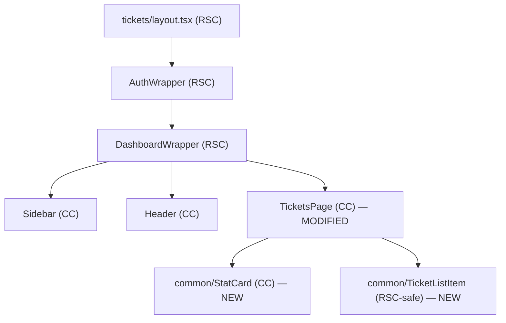

# My Tickets List Page — UI Update

## What the screenshot shows

The `DashboardWrapper` (Sidebar + Header) is unchanged. Only the **`<main>`** content area changes:

```
┌────────────────────────────────────────────────────────┐
│ < My Tickets                    Select Duration ▾      │  ← page header row
├────────────────────────────────────────────────────────┤
│  0 Open Tickets  │  0 In-Progress Tickets  │  2 Closed │  ← 3 StatCard chips
├────────────────────────────────────────────────────────┤
│  [ Search here ... ]                                   │  ← search input
├────────────────────────────────────────────────────────┤
│  #67851 - PF                                           │
│  Claim submitted for advance payment                   │  ← TicketListItem
│  Created On: 18-Mar-2026                               │
│──────────────────────────────────────────────────────  │
│  #67773 - Office Facilities                            │
│  Bike parking sticker request                          │
│  Created On: 13-Mar-2026                               │
└────────────────────────────────────────────────────────┘
```

## Rendering Strategy

**Client Component** (`'use client'`) — needs `useState` for active stat filter, search term, and duration. Mock JSON data (no RTK Query for now, matching `TicketDetailPage` pattern).

## Existing components that stay unchanged

- [`src/components/DashboardWrapper/`](src/components/DashboardWrapper/index.tsx) — Sidebar + Header grid shell (untouched)
- [`src/app/tickets/layout.tsx`](src/app/tickets/layout.tsx) — AuthWrapper + DashboardWrapper (untouched)
- [`src/app/tickets/page.tsx`](src/app/tickets/page.tsx) — RSC page shell (untouched)
- [`src/components/common/CommentSection/`](src/components/common/CommentSection/index.tsx) — unchanged
- [`src/components/common/TicketDetailCard/`](src/components/common/TicketDetailCard/index.tsx) — unchanged

## New + Modified Files

### New: `src/data/my-tickets.json`

Sample data for the listing page — stats object, default duration, and ticket array with `id`, `category`, `title`, `createdAt` fields. Matches exactly what the screenshot shows (0 open, 0 in-progress, 2 closed; two ticket rows).

### New: `src/components/common/StatCard/index.tsx` + `stat-card.module.scss`

Reusable micro-component. Props:

- `count: number` — large number displayed
- `label: string` — subtitle (e.g. "Open Tickets")
- `isActive: boolean` — purple filled background when active
- `onClick: () => void` — filter callback

Extracted from the existing `TicketDetailPage/dependencies/TicketStats` logic so it can be reused on any dashboard page.

### New: `src/components/common/TicketListItem/index.tsx` + `ticket-list-item.module.scss`

Reusable micro-component for one ticket row. Props:

- `id: number`
- `category: string`
- `title: string`
- `createdAt: string` — formatted as `dd-MMM-yyyy`

Renders: `#67851 - PF` (muted), bold title, `Created On: 18-Mar-2026` (muted). Wraps in a `<Link href={/tickets/${id}}>` for navigation.

### Modified: `src/components/TicketsPage/index.tsx`

Rebuilt to match the screenshot layout using the two new common components:

- Page header: back arrow (`useRouter().back()`), "My Tickets" `<h1>`, duration `<select>`
- Stat row: three `<StatCard>` instances driven by `mockData.stats`
- Search input with local state
- Filtered ticket list: `<TicketListItem>` per entry, filtered by `activeFilter` and `searchTerm`

Keeps `'use client'` (needs `useState`, `useRouter`).

### Modified: `src/components/TicketsPage/TicketsPage.module.scss`

Updated styles to match the page layout: header row, stat grid (3-column), search box, and ticket list.

## Component Hierarchy



## Steps (dependency order)

1. Create `src/data/my-tickets.json` — stats + ticket list sample data
2. Create `src/components/common/StatCard/index.tsx` + `stat-card.module.scss`
3. Create `src/components/common/TicketListItem/index.tsx` + `ticket-list-item.module.scss`
4. Rewrite `src/components/TicketsPage/index.tsx` using new components + mock data
5. Update `src/components/TicketsPage/TicketsPage.module.scss`

## Risks / Open Questions

- **`TicketDetailPage/dependencies/TicketStats`** does the same job as the new `common/StatCard` — it can be refactored later to use `StatCard` internally, but that's out of scope here to keep changes minimal.
- **`activeFilter` filtering**: the screenshot shows stat cards filtering the ticket list — the mock JSON must include tickets with different `status` values so the filter has an observable effect.
- **Back arrow behavior**: `useRouter().back()` in the Client Component is the correct pattern; if no history exists it is a no-op (acceptable for mock UI).
- **`CreateTicketForm` + `TicketList` (RTK Query)** currently in `TicketsPage` will be replaced by the mock-data approach — this matches the ticket's scope (UI only, same as `TicketDetailPage`).
