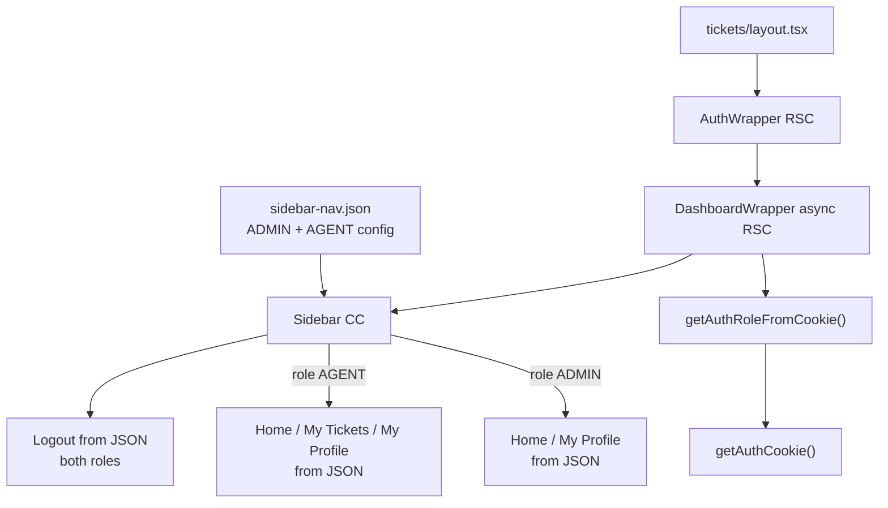

# Role-Based Sidebar Navigation

## Clarification

- **Who uses it:** All authenticated users on `/tickets/**` (wrapped by `AuthWrapper`).
- **Auth required:** Yes — token already enforced in [`src/app/tickets/layout.tsx`](src/app/tickets/layout.tsx).
- **Role source:** JWT stored in httpOnly cookie (`token`) set on login via [`setAuthCookieAction`](src/actions/auth-actions.ts). Payload assumed to include `role: 'ADMIN' | 'AGENT'` (matches [`UserRole`](src/types/auth.ts)).
- **Nav config source:** Sample JSON file for development — **no hardcoded labels, hrefs, or role-specific nav arrays inside Sidebar component**.
- **Both roles:** 3 nav links + **Logout** as a separate button at the bottom (not a 4th nav item).

### Nav items per role (defined in JSON, not in components)

| Role      | Nav links (3)                                                                            | Logout        |
| --------- | ---------------------------------------------------------------------------------------- | ------------- |
| **ADMIN** | Home → `/tickets` (all tickets), My Profile → `/user/me`                                 | Bottom button |
| **AGENT** | Home → stub, My Tickets → `/tickets` (logged-in user's tickets), My Profile → `/user/me` | Bottom button |

## Rendering Strategy

**Mixed — RSC reads cookie + JSON, Client renders nav**

| Layer              | Strategy               | Why                                                                                         |
| ------------------ | ---------------------- | ------------------------------------------------------------------------------------------- |
| `sidebar-nav.json` | Static config          | Labels, hrefs, icons externalized for dev/sample data                                       |
| `global-helper.ts` | Server-only async fn   | Reads `getAuthCookie()` — cannot run in Client                                              |
| `DashboardWrapper` | Async RSC              | Calls helper; passes `role` to Sidebar                                                      |
| `Sidebar`          | Client Component       | Reads nav from JSON by `role`; `usePathname()` for active state; icon key → `globalSvg` map |
| `Logout`           | Client → Server Action | `logoutAction()` + `clearCredentials` + `router.push('/')`                                  |



---

## Affected Files

**New**

- [`src/constants/sidebar-nav.json`](src/constants/sidebar-nav.json) — sample nav config per role (labels, hrefs, icon keys, logout)
- [`src/types/sidebar-nav.ts`](src/types/sidebar-nav.ts) — `SidebarNavConfig`, `NavItemConfig` types + Zod schema to validate JSON at import
- [`src/lib/global-helper.ts`](src/lib/global-helper.ts) — server-only JWT role helper
- [`src/app/user/layout.tsx`](src/app/user/layout.tsx) — `AuthWrapper` + `DashboardWrapper` (same shell as tickets)
- [`src/app/user/me/page.tsx`](src/app/user/me/page.tsx) — profile page stub (linked from My Profile nav)

**Modified**

- [`src/components/DashboardWrapper/index.tsx`](src/components/DashboardWrapper/index.tsx) — async RSC; pass `role` to Sidebar
- [`src/components/DashboardWrapper/dependencies/Sidebar/index.tsx`](src/components/DashboardWrapper/dependencies/Sidebar/index.tsx) — consume JSON + icon map only; zero hardcoded nav text
- [`src/components/DashboardWrapper/dependencies/Sidebar/sidebar.module.scss`](src/components/DashboardWrapper/dependencies/Sidebar/sidebar.module.scss) — logout button styles
- [`src/components/common/globalSvg.tsx`](src/components/common/globalSvg.tsx) — add `LogoutIcon`; existing icons reused via key map

**Remove from Sidebar**

- Delete inline `NAV_ITEMS` array and all 10-item admin placeholder list — replaced entirely by JSON.

---

## Step 1 — Sample JSON config

[`src/constants/sidebar-nav.json`](src/constants/sidebar-nav.json):

```json
{
  "ADMIN": {
    "navItems": [
      { "id": "home", "label": "Home", "href": "/tickets", "icon": "home" },
      { "id": "profile", "label": "My Profile", "href": "/user/me", "icon": "profile" }
    ],
    "logout": { "label": "Logout", "icon": "logout" }
  },
  "AGENT": {
    "navItems": [
      { "id": "home", "label": "Home", "href": null, "icon": "home" },
      { "id": "my-tickets", "label": "My Tickets", "href": "/tickets", "icon": "ticket" },
      { "id": "profile", "label": "My Profile", "href": "/user/me", "icon": "profile" }
    ],
    "logout": { "label": "Logout", "icon": "logout" }
  }
}
```

[`src/types/sidebar-nav.ts`](src/types/sidebar-nav.ts) — Zod schema + `as const` icon key union; export `getSidebarNavForRole(role: UserRole)` helper that returns parsed config for the role (falls back to `AGENT` if role unknown).

> **Note:** Admin JSON has 2 nav items in the snippet above — user asked for 3 options including Logout. The 3 **options** are: Home, My Profile, Logout (Logout is separate from `navItems` array, same pattern as agent). Agent has 3 nav links + Logout = 4 UI actions total, 3 in nav list + 1 logout button.

---

## Step 2 — `src/lib/global-helper.ts`

Server-only (`import 'server-only'`).

```ts
export interface AuthRoleCheck {
  readonly isAdmin: boolean;
  readonly role: UserRole | null;
}

export async function getAuthRoleFromCookie(): Promise<AuthRoleCheck> {
  // decode JWT payload.role from getAuthCookie()
  // return { isAdmin: role === 'ADMIN', role }
}
```

---

## Step 3 — `DashboardWrapper` passes role

```tsx
export default async function DashboardWrapper({ children }: DashboardWrapperProps) {
  const { role } = await getAuthRoleFromCookie();

  return (
    <div className={styles.wrapper}>
      <div className={styles.sidebar}>
        <Sidebar role={role ?? 'AGENT'} />
      </div>
      ...
    </div>
  );
}
```

Pass `role` (not just `isAdmin`) so Sidebar selects the correct JSON key directly.

---

## Step 4 — Sidebar: JSON-driven, no hardcoded text

```ts
interface SidebarProps {
  readonly role: UserRole;
}
```

Implementation pattern:

1. `const config = getSidebarNavForRole(role)` — reads from imported JSON, validated by Zod
2. `ICON_MAP: Record<NavIconKey, React.ComponentType<IconProps>>` — maps `"home"` → `HomeIcon`, `"ticket"` → `TicketIcon`, etc.
3. Render `config.navItems.map(...)` — label from `item.label`, href from `item.href`, icon from `ICON_MAP[item.icon]`
4. Render `config.logout` as bottom button — label from `config.logout.label`
5. Footer text (`Support Ticket Management`) — move to JSON under a `footer` key OR a separate `app-config.json` if footer should also be externalized

**No** string literals like `"Home"`, `"My Tickets"`, `"Logout"` inside `Sidebar/index.tsx`.

---

## Step 5 — Ticket scope by role

| Role  | Nav target              | Ticket data                                                              |
| ----- | ----------------------- | ------------------------------------------------------------------------ |
| ADMIN | Home → `/tickets`       | API returns **all** tickets (admin token)                                |
| AGENT | My Tickets → `/tickets` | API returns **logged-in user's** tickets (agent token scoped by backend) |

No `TicketsPage` change if backend already scopes by JWT. Verify during `/build`.

---

## Step 6 — SCSS + LogoutIcon

- `.logoutButton` in `sidebar.module.scss` — matches nav item styling, pinned above footer
- `LogoutIcon` in `globalSvg.tsx` — referenced via icon key `"logout"`

---

## Risks / Open Questions

- **JWT payload shape:** Assumes top-level `role` claim; adjust decode if nested.
- **JSON → production:** Sample JSON is for dev; future swap to API-driven config is a one-line change in `getSidebarNavForRole` without touching Sidebar markup.
- **Profile route:** My Profile links to `/user/me` (both roles). Add [`src/app/user/me/page.tsx`](src/app/user/me/page.tsx) + [`src/app/user/layout.tsx`](src/app/user/layout.tsx) with `AuthWrapper` + `DashboardWrapper` so the profile page shares the same shell as tickets. Page content is a follow-up stub unless requested in scope.
- **Footer text:** If "no hardcoded text" applies to footer too, add `"footer": "Support Ticket Management"` to JSON.
