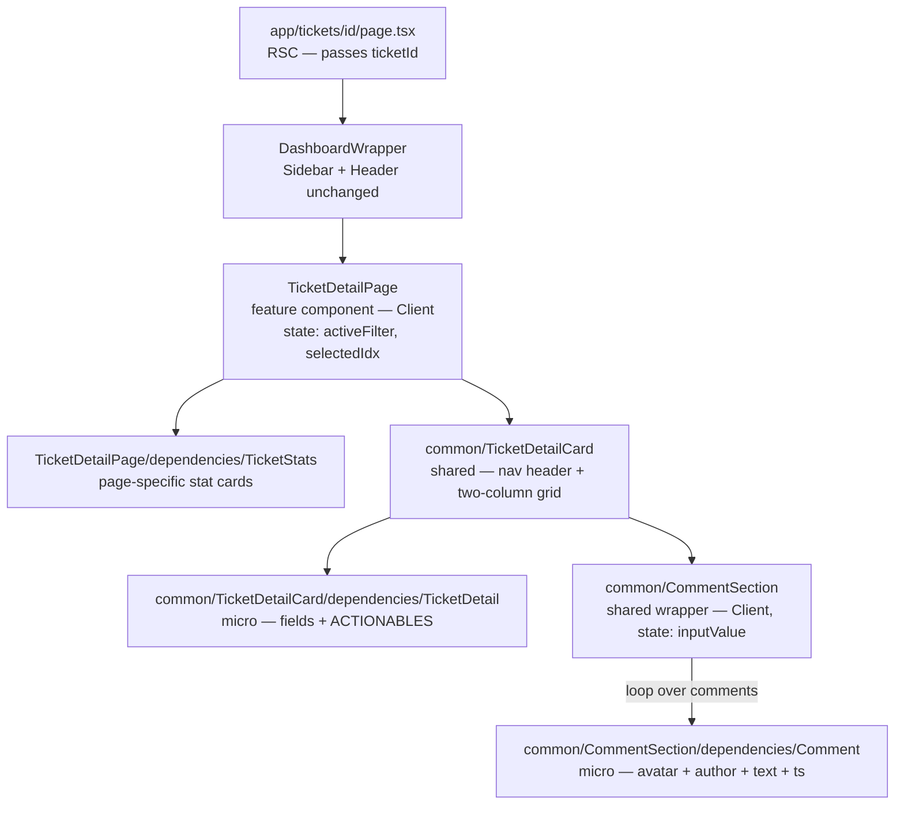

# Ticket Detail Page — Content Section

## What the screenshot shows

The `main` area inside the existing `DashboardWrapper` grid (`grid-row: 2 / grid-column: 2`) must render:

1. **Page header row** — "My Tickets" title (left) + "Select Duration: Last 6 Months" dropdown (right)
2. **Stats row** — three cards: Open Tickets · In-Progress Tickets · Closed Tickets; active card highlighted in deep-purple
3. **TicketDetailCard** — card with a nav header + two-column body:
   - Card header: back-arrow · "Ticket ID – #67851 ▾" dropdown · prev/next arrows (right)
   - Left column: `TicketDetail` micro-component
   - Right column: `CommentSection` wrapper (renders `Comment` micro-components in a loop)

The **sidebar and header are already wired** via `src/app/tickets/layout.tsx` → `DashboardWrapper`; no changes needed there.

## Rendering Strategy

**Client Component + static mock data.**
The component needs local state (active stat filter, selected ticket index, comment input), so `'use client'` is required. Data comes from a local JSON file (no fetch/RTK Query needed for this task).

## Affected Files

### Mock data

- `src/data/ticket-detail.json` — NEW

### Feature page (`TicketDetailPage` — page-specific, not reusable)

- `src/components/TicketDetailPage/index.tsx` — MODIFY: page header row + `TicketStats` + `TicketDetailCard`
- `src/components/TicketDetailPage/ticket-detail-page.module.scss` — NEW
- `src/components/TicketDetailPage/dependencies/TicketStats/index.tsx` — NEW: stat cards (page-specific)
- `src/components/TicketDetailPage/dependencies/TicketStats/ticket-stats.module.scss` — NEW

### Shared common components (`src/components/common/{Name}/index.tsx`)

- `src/components/common/TicketDetailCard/index.tsx` — NEW: card wrapper
- `src/components/common/TicketDetailCard/ticket-detail-card.module.scss` — NEW
- `src/components/common/TicketDetailCard/dependencies/TicketDetail/index.tsx` — NEW: left panel micro-component
- `src/components/common/TicketDetailCard/dependencies/TicketDetail/ticket-detail.module.scss` — NEW
- `src/components/common/CommentSection/index.tsx` — NEW: comment list wrapper
- `src/components/common/CommentSection/comment-section.module.scss` — NEW
- `src/components/common/CommentSection/dependencies/Comment/index.tsx` — NEW: single comment micro-component
- `src/components/common/CommentSection/dependencies/Comment/comment.module.scss` — NEW

### Deleted (obsolete)

- `src/components/TicketDetailPage/dependencies/TicketInfo/index.tsx` — DELETE
- `src/components/TicketDetailPage/dependencies/CommentSection/index.tsx` — DELETE

## Mock Data Shape (`src/data/ticket-detail.json`)

```json
{
  "stats": { "open": 0, "inProgress": 0, "closed": 2 },
  "duration": "Last 6 Months",
  "tickets": [
    {
      "id": 67851,
      "title": "Claim submitted for advance payment",
      "description": "Hi Team, I have submitted a claim for advance payment. Kindly share the contact details of the concerned person so that the claim can be processed on time.",
      "status": "closed",
      "type": "PF",
      "subType": "PF Information",
      "assignee": "HR Team",
      "createdAt": "2026-03-18T12:03:00.000Z"
    },
    {
      "id": 67852,
      "title": "Leave balance discrepancy",
      "description": "My leave balance shows incorrect data for the current quarter.",
      "status": "open",
      "type": "Leave",
      "subType": "Leave Balance",
      "assignee": "HR Team",
      "createdAt": "2026-03-20T09:15:00.000Z"
    }
  ],
  "comments": [
    {
      "id": 1,
      "ticketId": 67851,
      "authorName": "HR Team",
      "content": "Hi Raushan, Can you please elaborate your concern for better understanding.",
      "createdAt": "2026-03-18T14:58:00.000Z"
    },
    {
      "id": 2,
      "ticketId": 67851,
      "authorName": "HR Team",
      "content": "Status updated to \"In-Progress\"",
      "createdAt": "2026-03-18T14:59:00.000Z"
    },
    {
      "id": 3,
      "ticketId": 67851,
      "authorName": "HR Team",
      "content": "As discussed over chat, please note there is a defined process for the PF withdrawal... We're closing the ticket basis your confirmation.",
      "createdAt": "2026-03-18T15:18:00.000Z"
    }
  ]
}
```

## Component Architecture



## File Tree

```
src/
├── data/
│   └── ticket-detail.json               ← NEW
├── components/
│   ├── common/
│   │   ├── Button.tsx                   (existing)
│   │   ├── globalSvg.tsx                (existing)
│   │   ├── TicketDetailCard/            ← NEW (shared)
│   │   │   ├── index.tsx
│   │   │   ├── ticket-detail-card.module.scss
│   │   │   └── dependencies/
│   │   │       └── TicketDetail/        ← NEW (micro)
│   │   │           ├── index.tsx
│   │   │           └── ticket-detail.module.scss
│   │   └── CommentSection/              ← NEW (shared)
│   │       ├── index.tsx
│   │       ├── comment-section.module.scss
│   │       └── dependencies/
│   │           └── Comment/             ← NEW (micro)
│   │               ├── index.tsx
│   │               └── comment.module.scss
│   └── TicketDetailPage/
│       ├── index.tsx                    ← MODIFY
│       ├── ticket-detail-page.module.scss ← NEW
│       └── dependencies/
│           └── TicketStats/             ← NEW (page-specific)
│               ├── index.tsx
│               └── ticket-stats.module.scss
```

## Steps (in dependency order)

1. **`src/data/ticket-detail.json`** — create mock data (2 tickets, 3 comments, stats)
2. **`common/CommentSection/dependencies/Comment`** — micro-component: avatar circle (initials), author bold, content, formatted timestamp
3. **`common/CommentSection`** — wrapper: "Load Previous Comments" link, maps `comments` → `<Comment />`, controlled textarea + send icon button
4. **`common/TicketDetailCard/dependencies/TicketDetail`** — micro-component: title, description, created-on, ACTIONABLES grid (Type, Sub-Type, Status, Assignee)
5. **`common/TicketDetailCard`** — white card: nav header (back arrow, ID dropdown, prev/next); two-column body (`<TicketDetail>` | `<CommentSection>`)
6. **`TicketDetailPage/dependencies/TicketStats`** — 3 stat cards; active card highlighted in deep-purple via conditional SCSS class
7. **`TicketDetailPage/index.tsx`** — page header row (title + duration dropdown), `<TicketStats>`, `<TicketDetailCard>` (imported from `@/components/common/TicketDetailCard`); wires `selectedIdx` state for prev/next navigation; deletes old `TicketInfo` + `CommentSection` dependency files

## Risks / Open Questions

- **Type extension**: `Ticket` in `ticket-api.ts` lacks `type`, `subType`, `assignee`. A local `TicketDetailItem` interface is defined in the mock data types — no changes to the shared `Ticket` type.
- **Obsolete files**: `TicketDetailPage/dependencies/TicketInfo/` and `TicketDetailPage/dependencies/CommentSection/` will be deleted (replaced by the deeper nested structure under `TicketDetailCard/dependencies/`).
- **Navigation arrows**: `selectedIdx` state in `TicketDetailPage` drives `tickets[selectedIdx]`; no router push needed for static mock.
- **Comment send**: appends to local `comments` state only (mock mode); can be wired to `useCreateCommentMutation` later.
- **Date formatting**: `Intl.DateTimeFormat` used inline — no new library.
