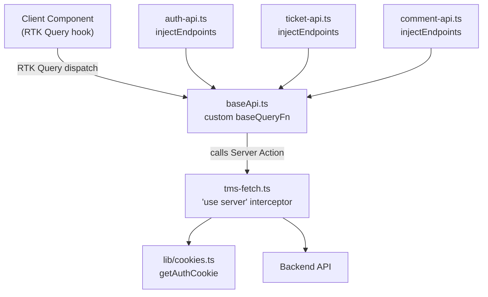

# tmsFetch Global Interceptor & Per-Feature Services

## Architecture



**Key constraint**: `tmsFetch` is a Server Action. RTK Query's `baseQueryFn` runs on the client and calls it via Next.js's Server Action boundary. This keeps the auth token server-side only (never in `localStorage` or client bundle).

## Rendering Strategy

**Client Component + Server Action** — RTK Query hooks remain in client components; `tmsFetch` (`'use server'`) executes the actual `fetch` on the server, reading the auth token from the `httpOnly` cookie via `getAuthCookie()`.

## Affected Files

- `src/lib/tms-fetch.ts` — **new**: `'use server'` interceptor; all HTTP verbs + FormData; reads auth cookie; returns `{ data?, error? }`
- `src/services/baseApi.ts` — **update**: replace `fetchBaseQuery` with a custom `BaseQueryFn` that calls `tmsFetch`; remove `localStorage` token read
- `src/services/ticket-api.ts` — **rename** from `ticketApi.ts` (kebab-case, no logic change); types stay inline
- `src/services/auth-api.ts` — **new**: `login` mutation + `getMe` query via `baseApi.injectEndpoints`; `onQueryStarted` calls `setAuthCookieAction` after login
- `src/services/comment-api.ts` — **new**: comment CRUD via `baseApi.injectEndpoints`
- `src/actions/auth-actions.ts` — **update**: remove `loginAction` (moved to `auth-api`); keep `logoutAction`; add thin `setAuthCookieAction(token)` for post-login cookie write
- `src/constants/api-endpoints.ts` — **update**: add `COMMENTS` endpoints
- `src/lib/store/index.ts` — **update**: import `baseApi` reducer directly; import feature services as side-effect imports to register endpoints

## Steps

1. **`src/constants/api-endpoints.ts`** — add `COMMENTS.BY_TICKET(ticketId)` and `COMMENTS.BY_ID(ticketId, commentId)` + `AUTH.ME` if missing

2. **`src/lib/tms-fetch.ts`** (new, `'use server'`) — define `TmsFetchOptions` interface, build URL with query params, set `Authorization` header from `getAuthCookie()`, detect `FormData` vs JSON body (skip `Content-Type` for FormData, set `application/json` for JSON), call `fetch`, normalize response to `{ data } | { error: { status, message } }`

   ```ts
   "use server";
   export interface TmsFetchOptions {
     method?;
     body?;
     headers?;
     params?;
   }
   export interface TmsFetchResult<T> {
     data?: T;
     error?: { status: number; message: string };
   }
   export async function tmsFetch<T>(
     path: string,
     opts?: TmsFetchOptions
   ): Promise<TmsFetchResult<T>>;
   ```

3. **`src/services/baseApi.ts`** — replace `fetchBaseQuery` with a custom `baseQueryFn`:
   - Maps RTK Query's `{ url, method, body, params, headers }` args → `tmsFetch` call
   - Returns `{ data }` on success, `{ error: { status, data } }` on failure (RTK Query `FetchBaseQueryError` shape)
   - Remove `prepareHeaders` / `localStorage` read (auth is now in `tmsFetch`)

4. **`src/services/ticket-api.ts`** — rename file from `ticketApi.ts`; update any internal imports; no logic changes

5. **`src/actions/auth-actions.ts`** — remove `loginAction`; keep `logoutAction`; add:

   ```ts
   export async function setAuthCookieAction(token: string): Promise<void>;
   ```

6. **`src/services/auth-api.ts`** (new) — `login` mutation sends `POST /auth/login` (no auth header needed); `onQueryStarted` calls `setAuthCookieAction(data.token)` on success; `getMe` query hits `GET /auth/me`

7. **`src/services/comment-api.ts`** (new) — `getComments(ticketId)`, `createComment({ ticketId, content })`, `deleteComment({ ticketId, commentId })` via `baseApi.injectEndpoints`; provide/invalidate `Comment` tags

8. **`src/lib/store/index.ts`** — switch to `baseApi.reducerPath` / `baseApi.reducer` / `baseApi.middleware`; add side-effect imports:
   ```ts
   import "@/services/auth-api";
   import "@/services/ticket-api";
   import "@/services/comment-api";
   ```

## Risks / Open Questions

- **FormData through Server Action boundary**: Next.js supports `FormData` as a serializable Server Action argument. File objects inside FormData cross the boundary — verify against the Next.js version in use (`node_modules/next/dist/docs/`).
- **Double network hop**: client → Next.js server (Server Action) → backend API. Adds latency. Acceptable trade-off for keeping the token server-side only.
- **Login cookie timing**: `setAuthCookieAction` is called in `onQueryStarted` (async) — the cookie is set slightly after the mutation resolves client-side. Any immediate navigation after login must `await` the server action or use `router.push` inside `onQueryStarted` after the cookie write.
- **`loginAction` removal**: any component currently calling `loginAction` directly must be updated to use the `useLoginMutation` RTK Query hook instead.
- **Store import order**: feature api files must be imported (even as side effects) before the store is used, so endpoints are registered. The side-effect imports in `store/index.ts` guarantee this.
- **Tag type `Comment`** is already declared in `baseApi`'s `tagTypes` — no change needed there.
